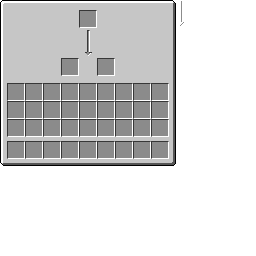

# Screen

## Prerequisites
Before we can get started, we need to have a class implementing ```HandledScreen``` of type ```ExampleScreenHandler```.
In action it would look a bit like this:

```java title="Initial screen"
public class ExampleScreen extends HandledScreen<ExampleScreenHandler> {
}
```

Then we need a field which is the texture of your gui. Mine looks like this:



```java
private static final Identifier TEXTURE = new Identifier(ExampleMod.MOD_ID, "textures/gui/example_gui.png");
```
This points to the ```resources/assets/MOD_ID/textures/gui/example_gui.png``` file.

You can see the progress arrow already!
Now you can implement everything your IDE asks for including the constructor matching super.

## Required Methods

### init()
```java 
@Override
protected void init() {
    super.init();
    titleY = 1000;//(1)!
    playerInventoryTitleY = 1000;//(2)!
}
```

1. This is the height of the title the block entity screen has, like you would see with vanilla block entities such as a furnace
2. This is the height of the title of your inventory that says ````Inventory```

### drawBackGround()

```java 
@Override
protected void drawBackground(DrawContext context, float delta, int mouseX, int mouseY) {
    RenderSystem.setShader(GameRenderer::getPositionTexProgram);
    RenderSystem.setShaderColor(1f, 1f, 1f, 1f);
    RenderSystem.setShaderTexture(0, TEXTURE);
    int x = (width - backgroundWidth) / 2;
    int y = (height - backgroundHeight) / 2;

    context.drawTexture(TEXTURE, x, y, 0, 0, backgroundWidth, backgroundHeight);

    renderProgressArrow(context, x, y);
}
```

### render()
```java
@Override
public void render(DrawContext context, int mouseX, int mouseY, float delta) {
    renderBackground(context, mouseX, mouseY, delta);
    super.render(context, mouseX, mouseY, delta);
    drawMouseoverTooltip(context, mouseX, mouseY);
}
```

## Non-required but recommended methods


### renderProgressArrow()

```java
private void renderProgressArrow(DrawContext context, int x, int y) {
    if(handler.isCrafting()) {
        context.drawTexture(TEXTURE, x + 85, y + 30, 176, 0, 8, handler.getScaledProgress());
    }
}
```

## [Finishing up](../other-things.md)
Now we can do the final things to complete our multiple output block entity!

[Finishing up](../other-things.md)

